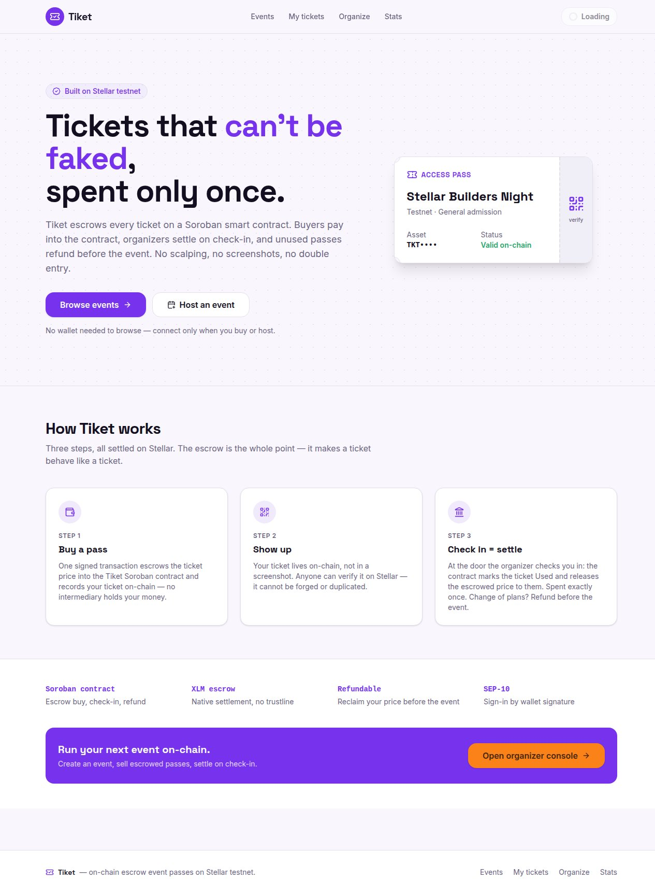
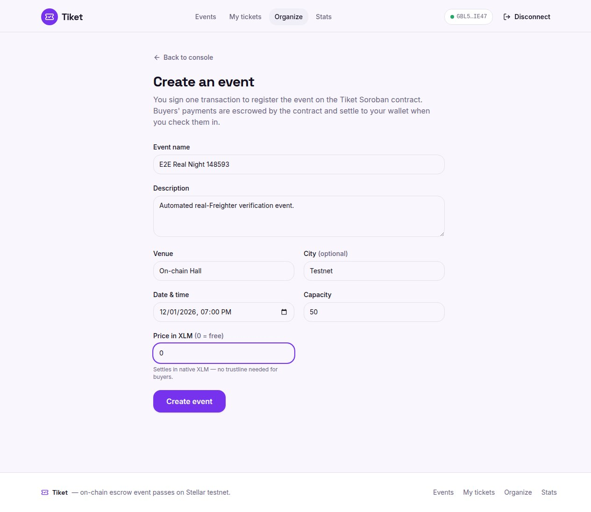
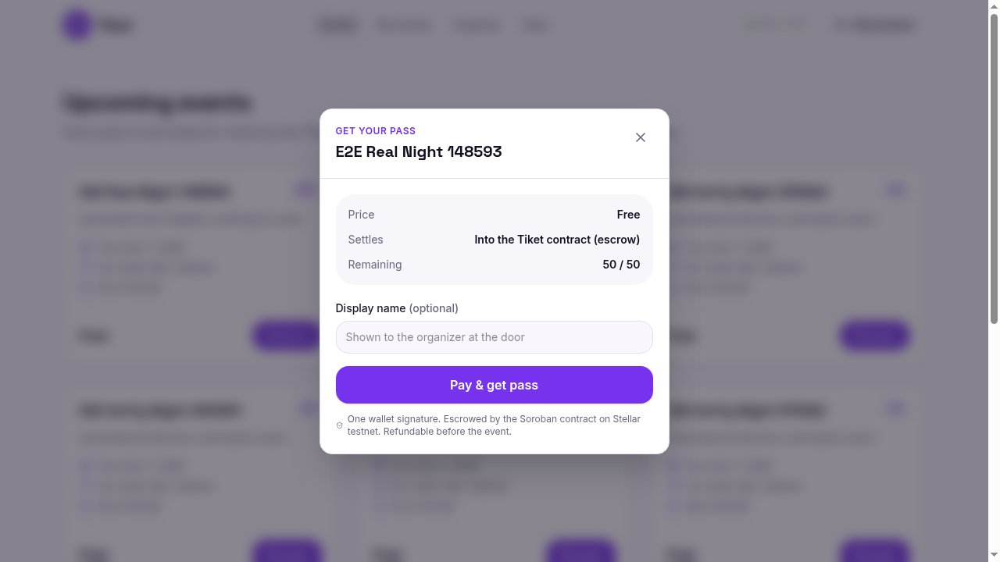
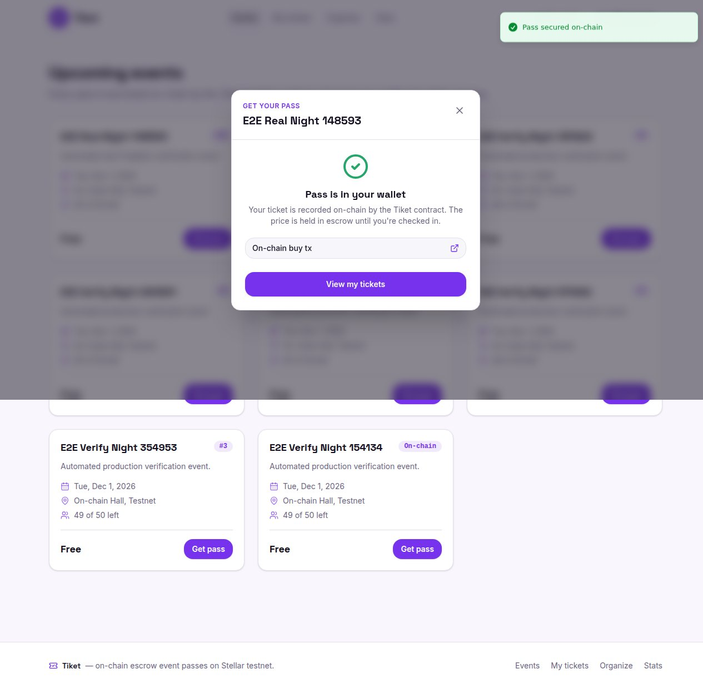
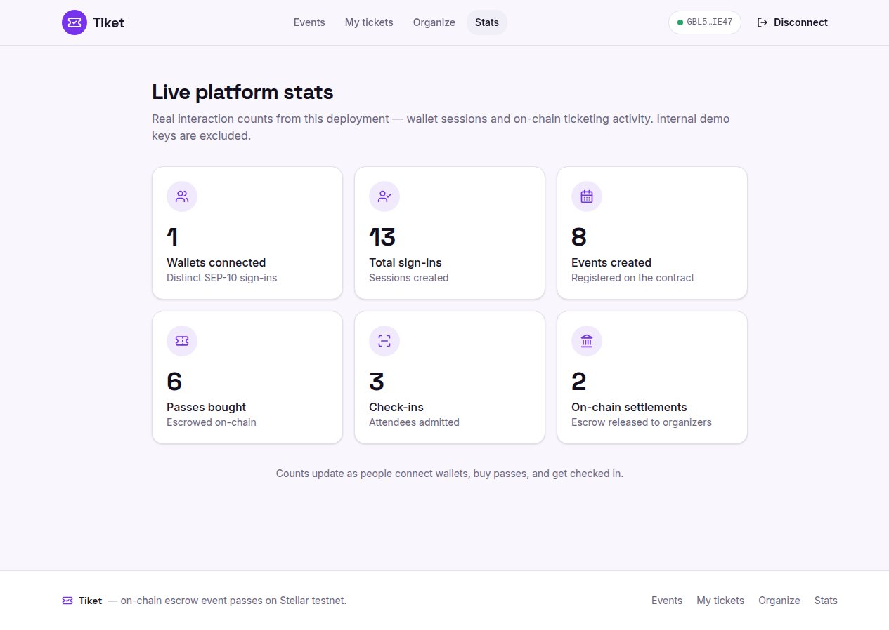
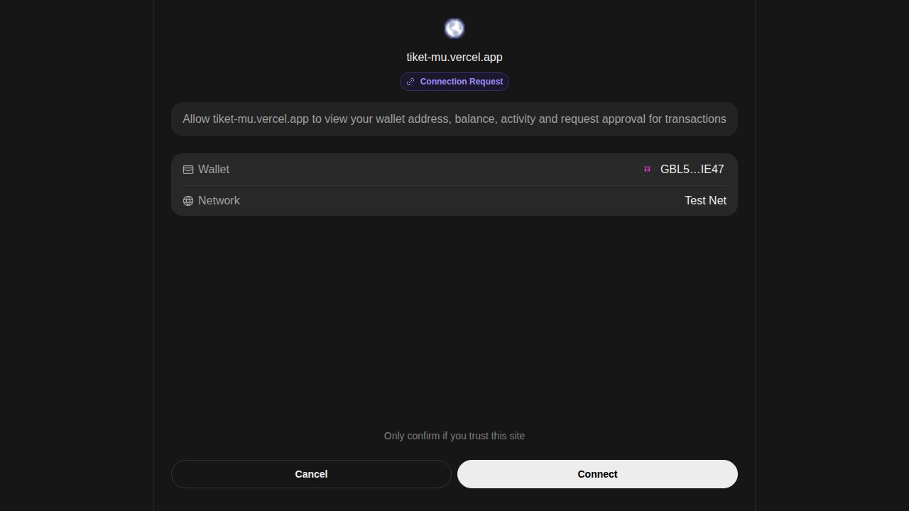
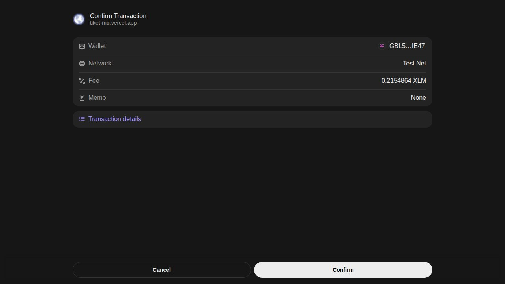
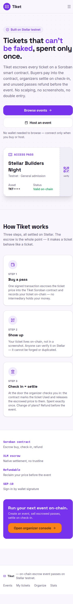
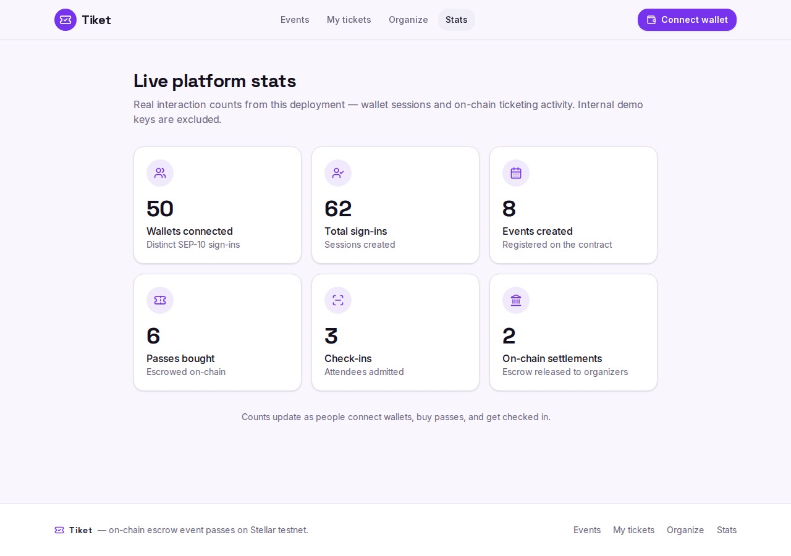

# Tiket — spec sheet

On-chain event ticketing on Stellar. The ticket price is escrowed inside a Soroban contract on `buy`, settles to the organizer on `check_in`, and is reclaimable by the buyer via `refund` until the event starts. The contract is custodian and rulebook; no intermediary holds the money.

| | |
|---|---|
| **Product** | Tiket — escrow ticketing + on-chain settlement/refund |
| **Live** | https://tiket-stellar.vercel.app (Vercel production) |
| **Network** | Stellar **mainnet** (`Public Global Stellar Network ; September 2015`) |
| **Contract** | `CDIQ6JCW6UGLKBNINAJKTDRICA5ZRP5MNS6HGB7I3NRTYRTDRDHO7Y6I` ([stellar.expert](https://stellar.expert/explorer/public/contract/CDIQ6JCW6UGLKBNINAJKTDRICA5ZRP5MNS6HGB7I3NRTYRTDRDHO7Y6I)) |
| **Settlement** | native XLM via SAC (USDC opt-in trustline helper) |
| **Stack** | Next.js 16 / React 19 / TS · Soroban (`soroban-sdk` 22, Rust) · Drizzle + Postgres · Freighter |
| **Auth** | SEP-10-style challenge → Freighter sign → session cookie |

```
01-landing → 02-connect-popup → 03-approve → 04-create-event
           → 05-buy → 06-success → 07-stats → 08-mobile
```

<p align="center">

</p>
<p align="center">


</p>
<p align="center">


</p>
<p align="center">



</p>

---

## Features

| Feature | Where it lives | Notes |
|---|---|---|
| Escrowed purchase | contract `buy` + `/api/purchase/*` | price → contract custody, ticket marked `Valid` |
| Settle-on-attendance | contract `check_in` + `/api/checkin/*` | escrow → organizer, ticket → `Used` |
| Pre-event refund | contract `refund` + `/api/refund/*` | escrow → buyer before `start_time`, ticket → `Refunded` |
| Cancel sales | contract `cancel_event` | organizer stops further sales; issued tickets still refundable |
| Wallet auth | `/api/auth/*` | challenge XDR, Freighter sign, server-verified session |
| XLM default settlement | `SOROBAN_TOKEN_SAC` | native XLM SAC, no trustline required |
| USDC opt-in | `/api/usdc/*` | one-tap `changeTrust` builder for the USDC trustline |
| Live usage stats | `/stats` + `/api/stats` | real DB-backed counts; demo wallets excluded via `DEMO_PUBLIC_KEYS` |
| Explorer receipts | every on-chain submit | response carries `stellar.expert` tx links |
| Double-spend guard | contract state machine | a ticket is checked-in or refunded at most once |

Every core write is a **build XDR → Freighter sign → submit** round-trip through Soroban RPC; on-chain routes run `maxDuration=60`.

## Live usage

Real interaction counts from this deployment. Demo keys are excluded.



| Metric | Value | Notes |
|---|---|---|
| Wallets connected | 50 | distinct SEP-10 sign-ins |
| Total sign-ins | 62 | sessions created |
| Events created | 8 | registered on the contract |
| Passes bought | 6 | escrowed on-chain |
| Check-ins | 3 | attendees admitted |
| On-chain settlements | 2 | escrow released to organizers |

Pulled live from `GET /api/stats` and rendered at [`/stats`](https://tiket-stellar.vercel.app/stats).

---

## Contract entrypoints

Rust, `soroban-sdk` 22, 15 passing unit tests. Source: [`contracts/tiket-ticketing/src/lib.rs`](contracts/tiket-ticketing/src/lib.rs). Deploy record: [`contracts/DEPLOYMENT.md`](contracts/DEPLOYMENT.md).

| Fn | Args | Auth | Returns | Effect |
|---|---|---|---|---|
| `initialize` | `admin: Address, token: Address` | once | `()` | set admin + settlement token, zero counters |
| `create_event` | `organizer: Address, price: i128, capacity: u32, start_time: u64` | organizer | `u64` | record event, return `event_id` |
| `buy` | `event_id: u64, buyer: Address` | buyer | `u64` | SAC `transfer(buyer→contract)` escrow, record `Valid` ticket, return `ticket_id` |
| `check_in` | `ticket_id: u64` | organizer | `()` | `transfer(contract→organizer)`, mark `Used` |
| `refund` | `ticket_id: u64` | ticket owner | `i128` | before `start_time`: `transfer(contract→owner)`, mark `Refunded`, return amount |
| `cancel_event` | `event_id: u64` | organizer | `()` | mark event `Cancelled` |
| `get_event` | `event_id: u64` | — | `Event` | view |
| `get_ticket` | `ticket_id: u64` | — | `Ticket` | view |
| `total_events` | — | — | `u64` | view |
| `total_tickets` | — | — | `u64` | view |
| `get_admin` | — | — | `Address` | view |
| `get_token` | — | — | `Address` | view |

Auth is enforced with `require_auth`; the source-account signature on the submitted tx covers both the contract call and its inner SAC transfer. Free events (`price == 0`) skip the token transfer. Instance + entry storage TTLs are bumped on every write so pending escrow never expires.

### On-chain deploy facts (mainnet)

| | |
|---|---|
| Wasm hash | `781e2616387a68e4f90f96011f72574862fdbf96edcc8f8661970b921b47ccfe` |
| Admin / deployer | `GDVSK3WR5N5LVMBPHVX6VXCJLLKA5YBUG236G5EYDVV2PTNU6MIZRZ2M` |
| Settlement token (XLM SAC) | `CAS3J7GYLGXMF6TDJBBYYSE3HQ6BBSMLNUQ34T6TZMYMW2EVH34XOWMA` |
| Soroban RPC | `https://mainnet.sorobanrpc.com` |
| Deploy tx | `d1745e753ffc771feb2c134931c6225990ad07b7a6f58101dcc85e0259ec418a` |
| Init tx | `a02333cd0be96c36c602887645eb0deed8f301633e73cc79b6dcde47bdddccb4` |
| First `create_event` tx (Stellar Hackathon) | `63466df584e64a35174230d88397f75ca554b62bd11351dc73aa3b2eeb4643bb` |

---

## Pages

| Path | Purpose |
|---|---|
| `/` | landing — escrow model |
| `/events` | browse events, buy a pass (connect on demand) |
| `/tickets` | buyer's passes + refund |
| `/dashboard` | organizer console |
| `/dashboard/events/new` | create event (signs `create_event`) |
| `/dashboard/events/[id]` | attendee list + check-in |
| `/stats` | live usage counts |

## API

| Method | Path | Purpose |
|---|---|---|
| POST | `/api/auth/challenge` | issue challenge XDR for a public key |
| POST | `/api/auth/verify` | verify signed challenge, set session cookie |
| POST | `/api/auth/logout` | clear session |
| GET | `/api/auth/me` | current session public key |
| GET | `/api/events` | list events (optional `?organizer=`) |
| POST | `/api/events` | persist event from signed `create_event` |
| POST | `/api/events/build` | build `create_event` invoke XDR |
| GET | `/api/events/[id]` | event detail |
| POST | `/api/purchase/build` | build `buy` invoke XDR |
| POST | `/api/purchase/submit` | submit signed `buy`, persist ticket |
| POST | `/api/checkin/build` | build `check_in` invoke XDR |
| POST | `/api/checkin/submit` | submit signed `check_in` |
| POST | `/api/refund/build` | build `refund` invoke XDR |
| POST | `/api/refund/submit` | submit signed `refund` |
| POST | `/api/usdc/build` | build USDC `changeTrust` XDR |
| POST | `/api/usdc/submit` | submit signed USDC trustline tx |
| GET | `/api/tickets` | tickets by `?eventId=` or `?buyer=` |
| GET | `/api/tickets/[id]` | ticket detail |
| GET | `/api/stats` | platform usage stats |
| GET | `/api/health` | liveness probe |

All responses use the `{ ok, data }` / `{ ok, error }` envelope.

---

## Assets

| Asset | Identifier | Role |
|---|---|---|
| XLM (native) | SAC `CAS3J7GYLGXMF6TDJBBYYSE3HQ6BBSMLNUQ34T6TZMYMW2EVH34XOWMA` | default settlement token; no trustline |
| USDC (mainnet) | issuer `GA5ZSEJYB37JRC5AVCIA5MOP4RHTM335X2KGX3IHOJAPP5RE34K4KZVN` | opt-in trustline via `/api/usdc/*` |

---

## Environment

| Var | Required | Default / note |
|---|---|---|
| `DRIZZLE_DATABASE_URL` | yes | Postgres connection string |
| `SESSION_SECRET` | yes | min 32 chars |
| `NEXT_PUBLIC_APP_NAME` | no | `Tiket` |
| `NEXT_PUBLIC_APP_URL` | no | `http://localhost:3001` |
| `NEXT_PUBLIC_STELLAR_NETWORK` | no | `testnet` (or `public`) |
| `STELLAR_NETWORK` | no | `testnet` |
| `STELLAR_HORIZON_URL` | no | `https://horizon-testnet.stellar.org` |
| `STELLAR_NETWORK_PASSPHRASE` | no | `Test SDF Network ; September 2015` |
| `SOROBAN_RPC_URL` | no | `https://soroban-testnet.stellar.org` |
| `SOROBAN_CONTRACT_ID` | no | defaults to the deployed testnet id |
| `NEXT_PUBLIC_SOROBAN_CONTRACT_ID` | no | same id, client-side |
| `SOROBAN_TOKEN_SAC` | no | XLM SAC settlement token |
| `STELLAR_ISSUER_PUBLIC` | no | platform issuer public key |
| `STELLAR_ISSUER_SECRET` | no | issuer secret (optional) |
| `SESSION_COOKIE_NAME` | no | `tiket_session` |
| `SESSION_TTL_SECONDS` | no | `604800` |
| `NONCE_TTL_SECONDS` | no | `300` |
| `USDC_ASSET_CODE` | no | `USDC` |
| `USDC_ASSET_ISSUER_TESTNET` | no | testnet USDC issuer |
| `USDC_ASSET_ISSUER_PUBLIC` | no | mainnet USDC issuer (selected when `STELLAR_NETWORK=public`) |
| `DEMO_PUBLIC_KEYS` | no | comma-separated keys excluded from `/stats` |

`.env.local` is required (no `.env.example` is shipped — create it with at least `DRIZZLE_DATABASE_URL` and `SESSION_SECRET`).

---

## Commands

| Command | Does |
|---|---|
| `pnpm install` | install deps (pnpm only) |
| `pnpm dev` | dev server on `:3001` |
| `pnpm build` | production build |
| `pnpm start` | serve production build |
| `pnpm lint` | Biome check |
| `pnpm test` | Vitest unit suite |
| `pnpm test:coverage` | unit coverage |
| `pnpm test:e2e` | Playwright e2e (drives the live deploy) |
| `pnpm db:push` | apply Drizzle schema |
| `pnpm db:studio` | Drizzle Studio |

### Local quick start

```bash
pnpm install
# create .env.local with DRIZZLE_DATABASE_URL and SESSION_SECRET (>=32 chars)
pnpm db:push
pnpm dev        # http://localhost:3001
```

### Build + deploy the contract

```bash
cd contracts
cargo +1.89.0-x86_64-pc-windows-gnu test                                # unit tests
cargo +1.89.0-x86_64-pc-windows-gnu build --release --target wasm32-unknown-unknown
stellar contract optimize --wasm target/wasm32-unknown-unknown/release/tiket_ticketing.wasm

# Testnet (auto-resolves XLM SAC + funds the deployer via friendbot):
NETWORK=testnet IDENTITY=tiket-deployer bash scripts/deploy.sh

# Mainnet (costs real XLM; deployer must be pre-funded):
NETWORK=mainnet IDENTITY=tiket-main bash scripts/deploy.sh
```

### e2e against the live deploy

```bash
PLAYWRIGHT_BASE_URL=https://tiket-stellar.vercel.app pnpm test:e2e
```

The e2e drives the deployed app through the `@stellar/freighter-api` v6 postMessage bridge, signing with a testnet key in Node.

---

## Mainnet

Live on **Stellar mainnet**. The app is network-driven (`STELLAR_NETWORK` / `NEXT_PUBLIC_STELLAR_NETWORK`), so the same code paths run against mainnet by flipping the env vars and pointing at the deployed contract id above. The first on-chain event is **Stellar Hackathon** (`onchain_event_id=1`, APAC, 30/7/2026, capacity 100, price 0.01 XLM) — created live with the deployer key above. Switch steps for testnet ↔ mainnet are in [`contracts/DEPLOYMENT.md`](contracts/DEPLOYMENT.md).

<sub>Built for the Stellar APAC hackathon · live on Stellar mainnet · money held by the contract, never a middleman.</sub>
</content>
